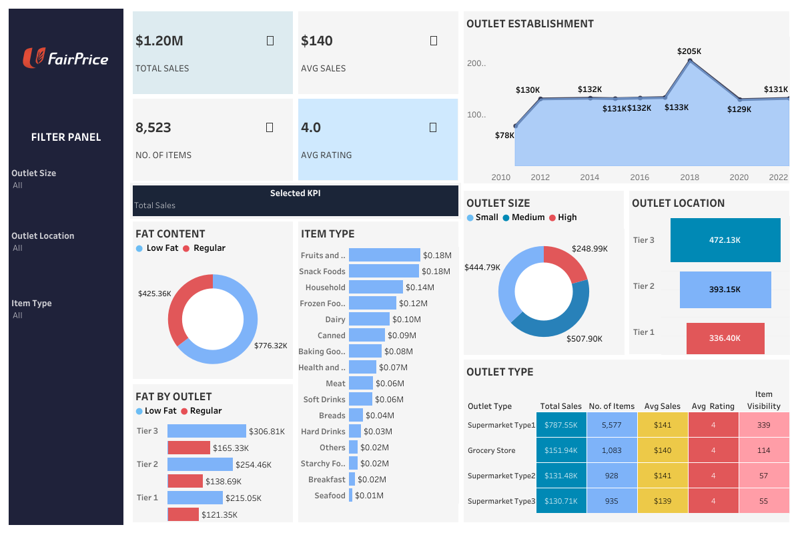

# FairPrice Grocery Analysis Dashboard (May 2025) 
Analyzing Fair Price sales performance, customer satisfaction, and inventory distribution for the marketing campaign in May 2025. An interactive Tableau dashboard can be found [Tableau](https://public.tableau.com/views/FairPriceGroceryDashboard/FairPrice?:language=en-US&:sid=&:redirect=auth&:display_count=n&:origin=viz_share_link)

## FairPrice Grocery Metrics and Dimensions

### Metrics (Measures)
- **Total Sales:** Total revenue generated (USD) across all transactions or products.
- **Average Sales:** Mean revenue per transaction or product (`SUM(Sales) / COUNT(*)`).
- **Number of Items:** Count of individual sale records (proxy for volume sold).
- **Average Rating:** Mean customer rating on a 1–5 scale.
- **Sales Percentage:** Segment’s share of overall sales (`SUM(Sales) / SUM(Sales) OVER()`).

### Dimensions (Attributes)
- **Item Fat Content:** Categorical label of product fat level (e.g. “Low Fat” vs. “Regular”).
- **Item Type:** Product category (e.g. Fruits and Vegetables, Dairy, Snack Foods, etc.).
- **Outlet Location Type:** Store’s geographic tier (Tier 1, Tier 2, Tier 3).
- **Outlet Size:** Store footprint classification (Small, Medium, High).
- **Outlet Type:** Store format (e.g. Supermarket Type1, Grocery Store, etc.).
- **Outlet Establishment Year:** Year the store first opened (2010–2022).
- **Product Visibility:** Percent visibility score in shelf placement (0–1 scale).
- **Product Weight:** Weight of each item in kilograms.

## Summary of Insights

### Low Fat vs. Regular Sales Split
- **Low Fat** products account for ~64% ( $0.78 M ) of total sales, while **Regular** products make up ~36% ($0.43 M).
- **Opportunity:** Promote targeted “Low Fat” campaigns—this segment is driving the majority of revenue.
### Top-Performing Product Categories
- **Fruits & Vegetables** ($178 K) and Snack Foods ($175 K) lead sales, together representing >30% of category revenue.
- **Opportunity:** Reevaluate pricing, promotions, or in-store placement for underperforming categories like Seafood.
### Outlet Location Tier Performance
- **Tier 3** stores generate the highest total sales for both Low Fat ($307 K) and Regular ($165 K).
- **Tier 1** stores trail by ~30% in combined sales.
- **Opportunity:** Expand Tier 3 best practices (product mix, shelving) into Tier 1 locations to boost sales there.
### Outlet Size Contribution
- **Medium-sized** outlets capture 42% of total sales, followed by **Small** at 37%, and **High** at 21%.
- Despite larger footprint, **High-size** stores underperform relative to **Medium**.
- **Opportunity:** Audit High-size outlets for assortment gaps or promotional execution issues.
### Store Age (Establishment Year) Trends
- **Newer stores (established 2018)** saw a revenue bump to $205K (50%) above the 10-year average of (~$132 K).
- **Older outlets (2010-2012)** started lower ($78K) but have steadily grown.
- **Opportunity**: Leverage learnings from the 2018 cohort’s design and rollout to rejuvenate older locations.
### Customer Ratings
- **Average rating** holds at (~4.0) across all segments, indicating stable customer satisfaction.
- **Opportunity:** Introduce targeted feedback loops in Tier 1 or High-size stores to sustain or raise perception further.

## Next Steps & Recommendations
- **Promotional Focus:** Roll out “Low Fat” cross-category bundles in Tier 1 outlets to capture incremental share.
- **Category Revitalization:** Test limited-time offers on lagging categories (Seafood, Breakfast) with eye-catching in-store displays.
- **Outlet Audit:** Conduct operational reviews at Underperforming “High” outlets to uncover merchandising or assortment issues.
- **Best Practice Sharing:** Document and replicate the product mix and marketing tactics from top-performing Tier 3 and 2018 stores across the network.
- **A/B Test Layouts:** Pilot new shelf layouts in Medium and High-size outlets to optimize product visibility and basket size.
By acting on these insights, FairPrice can better align product mix, promotional focus, and store execution to sustain growth and optimize profitability.

## Contact & Attribution
📋 Project Origin
This is a redacted replica of my May 2025 freelance engagement for FairPrice Grocery (Singapore) to run a marketing campaign.

⚠️ Original raw data has been altered to prevent any disclosure of customer or proprietary business information.

👤 Author: Ngan Huynh - Data Analyst (Freelance)

✉️ krishuynh2222@gmail.com

🔗 www.linkedin.com/in/krishuynh2222
